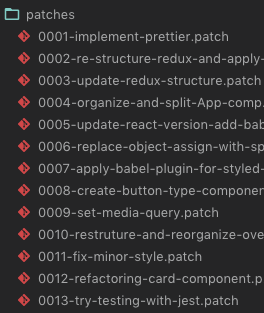

# Send an email to someone Using `git format-patch`

`git format-patch <comparing branch> -o patches`
- First, build the patch
- creates patch files under a /patches folder.





---

## Use gmail as the smtp server
To use git send-email to send your patches through the GMail SMTP server, edit `~/.gitconfig` to specify your account settings:

```
[sendemail]
	smtpEncryption = tls
	smtpServer = smtp.gmail.com
	smtpUser = yourname@gmail.com
	smtpServerPort = 587
```

- If you have multifactor authentication setup on your gmail account, you will need to generate an app-specific password for use with git send-email. Visit [https://security.google.com/settings/security/apppasswords](https://security.google.com/settings/security/apppasswords) to create it.


---

## Send patches via send-email


`git send-email  --to dahe.oh@gmail.com ./patches/*patch`
- send each .patch file under the /patches folder.
- `--smtp-debug=1` : use this for debug
- `Please login via web browser and try again` error : check the google account setting - changed it to `enable less-secure apps` and it worked.
- `sudo -H /usr/bin/cpan Net::SMTP::SSL` or `sudo -H cpan Net::SMTP::SSL` : when it throws `Can't locate Net/SMTP/SSL` error, you'll need to upgrade/inatall the `Net::SMTP::SSL`module.


